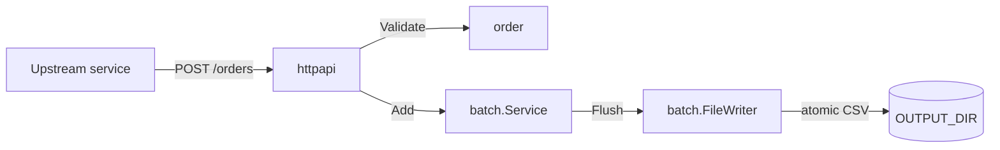

# UW Broadband Order Service

A Go microservice that receives broadband orders over HTTP, validates them, buffers them in memory, and writes batched CSV files to a configurable directory when the buffer reaches `BATCH_SIZE` or at end-of-day (UTC midnight).

Built on the **Go standard library only** — no third-party dependencies.

## Architecture



| Package | Responsibility |
|---------|----------------|
| `internal/order` | Domain model and postcode validation |
| `internal/batch` | In-memory buffer, EOD ticker, CSV writer |
| `internal/httpapi` | HTTP routes, JSON, error mapping, middleware |
| `internal/config` | Environment variable loading |
| `cmd/orderservice` | Wiring, graceful shutdown |

## Quick start

### Local

```bash
make ci                 # gofmt + vet + race tests
make build              # ./orderservice
export OUTPUT_DIR=/tmp/orders
export BATCH_SIZE=100
make run
```

### Container (Podman)

Requires a running Podman machine on macOS (`podman machine start`).

```bash
make podman-build
make podman-run    # builds, maps 8080, mounts ./data as OUTPUT_DIR
```

Manual run after build:

```bash
mkdir -p data
podman run --rm -p 8080:8080 \
  -e OUTPUT_DIR=/data \
  -e BATCH_SIZE=100 \
  -v "$(pwd)/data:/data" \
  orderservice:latest
```

## API

### `POST /orders`

Accepts `application/json`:

```json
{
  "customer_number": "CUST-001",
  "address": "1 High Street, London",
  "postcode": "SW1A 1AA",
  "placed_at": "2026-05-25T10:00:00Z"
}
```

`placed_at` is optional (defaults to server time). Postcode must be 1–8 characters of letters, digits, and spaces.

| Status | Meaning |
|--------|---------|
| `202 Accepted` | Order buffered |
| `400 Bad Request` | Validation or malformed JSON (`{"error","code"}`) |
| `413` | Body too large |
| `415` | Wrong Content-Type |

Example:

```bash
curl -s -X POST http://localhost:8080/orders \
  -H 'Content-Type: application/json' \
  -d '{"customer_number":"C1","address":"1 High St","postcode":"AB12 3CD"}'
```

### Health probes

| Route | Purpose |
|-------|---------|
| `GET /healthz` | Liveness |
| `GET /readyz` | Readiness |

Kubernetes example:

```yaml
livenessProbe:
  httpGet:
    path: /healthz
    port: 8080
readinessProbe:
  httpGet:
    path: /readyz
    port: 8080
```

## Environment variables

| Variable | Required | Default | Description |
|----------|----------|---------|-------------|
| `OUTPUT_DIR` | yes | — | Directory for batched CSV files (created if missing) |
| `BATCH_SIZE` | yes | — | Max orders per file; auto-flush at this count |
| `HTTP_ADDR` | no | `:8080` | HTTP listen address |
| `SHUTDOWN_TIMEOUT` | no | `15s` | Graceful shutdown timeout |

CSV columns: `customer_number`, `address`, `postcode`, `placed_at` (RFC3339 UTC). Files are written atomically (`*.csv.tmp` → rename).

## Development

```bash
make help               # all targets
make test-integration   # HTTP + CSV + shutdown integration test
make test-cover         # coverage report
```

## Design decisions

- **Stdlib only** — no frameworks; `net/http` ServeMux routing (Go 1.22+), `encoding/csv`, `log/slog`.
- **Accept interfaces, return concrete types** — `Writer`, `Clock`, `OrderAdder` defined at call sites; fakes in tests without mock libraries.
- **Atomic CSV writes** — downstream consumers never read partial files.
- **Graceful shutdown** — `http.Server.Shutdown` then final `Service.Flush` on SIGTERM.
- **Testable entrypoint** — `run(ctx, args, getenv, ...)` and `setup` for integration tests without subprocesses.

## Out of scope (wider system)

The original brief describes a larger platform. This repository implements **order intake and batching only**:

- SFTP upload to the third-party provider
- Status file download and order state reconciliation
- Customer email notifications

Those are natural extensions for a follow-up iteration.

## Project layout

```
.
├── cmd/orderservice/       entrypoint, integration tests
├── internal/order/         domain + postcode validation
├── internal/batch/         buffer, ticker, CSV writer
├── internal/httpapi/        HTTP handlers + middleware
├── internal/config/        env configuration
├── plan/                   architecture + per-PR design docs
├── Dockerfile              multi-stage distroless image
└── .github/workflows/      CI
```

## Plan and PR history

See [`plan/00-architecture-and-plan.md`](plan/00-architecture-and-plan.md) for the full design and incremental PR sequence (`PR-01` … `PR-07`).

---

## Original take-home brief

<details>
<summary>Insurance interview exercise (full context)</summary>

### Context

This take-home exercise should not take more than 60 minutes for an experienced Golang developer. Even if the description looks long, it's meant to introduce you to the bigger solution we'll work together through the remote live interview. Please take into account the context we describe, but don't feel you need to implement everything, just the component we ask you to. If you use AI assisted tools, bear in mind we'll ask you to implement changes on top of the code you provide without using AI, so it's fundamental that you understand your code inside out.

### The system we're building

Note: **The take home exercise only comprises "Take home task", you don't need to implement all this**

We're going to design a system that allows a customer to place Broadband orders via the Utility Warehouse mobile app.
UW provides many utility services to customers, one of them being Broadband.
UW acts as a broker for the Broadband service, and the installations and provisioning is done by a third party provider.

### Requirements

A UW customer can place an order for a broadband service using the Utility Warehouse mobile app.
When the order is received, we perform some basic validation to check if it can be fulfilled, such as confirming we provide service in that postcode.

At the end of the day, or when we have received 100 orders, they are batched int a CSV file and are submitted to the third party provider.

The provider, for the purposes of this exercise, reads from an SFTP server hosted by them.
Once the provider has processed the orders, they'll create a new file on a different directory of the SFTP server with the updated status or each order.

We need to download and process these updated files, perform some kind of matching against our state, and look for changes in the order, updating our local state.

We then notify the customer with the updated order via an email.

### Assumptions

- The mobile app already exists and has the facility to order other services such as energy or insurance.
- Authentication and authorization is already taken care of (ie, you don't need to include this in your design).
- Validation can fail (the customer provided a building number that doesn't exist, for example).
- The provider can reject an order (the local distribution point doesn't have capacity, for example).

### Take home task

You have been tasked with implementing one of the microservices that will be running on our Kubernetes cluster in order to provide the service described above. Our go-to language is Golang, but we are given freedom to decide which technologies we use for storage, communication between services, monitoring, etc. As we're in the initial phases of the project, feel free to make use of any technologies you're familiar with.

The microservice you have to write is the one that will receive orders from other services in our cluster and batch them. It should have an endpoint where new orders are submitted. We don't know the final details yet, but at least it should receive enough information to be able to match the order with a customer and be able to check that we can provide broadband service at the customer's address. The rest of the requirements are in the context above.

Your microservice will run in a Docker container. It can expect to receive two values as environment variables:

- Directory (string). where to put the orders files (another service will read this and send it to the 3rd party)
- Batch size (integer). The maximum number of items in each of the files that will be uploaded.

The format of the file required by our third party is still open, but it should include as a minimum: address, customer number, and a timestamp of when the order was placed.
Requests should return an ok code if the order was added to the batch, or an error if it failed validation. For the purpose of the exercise, only validate that the postcode is formed of numbers, letters and spaces only, with a maximum length of 8 characters.

Please structure your code **-even if it's a simple service for now- as you'd structure a production-grade service to run in a cluster**.

When submitting your code, please share your private Github or similar repo with us by using the `@ktzar` Github handle. If you are not familiar with this, you can send us a zip file, but we'd prefer to see your repo's Git history.

</details>
