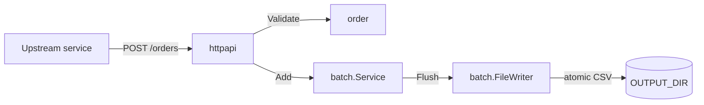

# Order Batching Service

HTTP order intake and CSV batching service — stdlib-only Go, production-style layout.

A Go microservice that receives service orders over HTTP, validates them, buffers them in memory, and writes batched CSV files to a configurable directory when the buffer reaches `BATCH_SIZE` or at end-of-day (UTC midnight).

Built on the **Go standard library only** — no third-party dependencies.

## Architecture



| Package | Responsibility |
|---------|----------------|
| `internal/order` | Domain model and postcode validation |
| `internal/batch` | In-memory buffer, EOD ticker, CSV writer |
| `internal/httpapi` | HTTP routes, JSON, error mapping, middleware |
| `internal/config` | Environment variable loading |
| `cmd/orderservice` | Wiring, graceful shutdown |

## Quick start

### Local

```bash
make ci                 # gofmt + vet + race tests
make build              # ./orderservice
export OUTPUT_DIR=/tmp/orders
export BATCH_SIZE=100
make run
```

### Container (Podman)

Requires a running Podman machine on macOS (`podman machine start`).

```bash
make podman-build
make podman-run    # builds, maps 8080, mounts ./data as OUTPUT_DIR
```

Manual run after build:

```bash
mkdir -p data
podman run --rm -p 8080:8080 \
  -e OUTPUT_DIR=/data \
  -e BATCH_SIZE=100 \
  -v "$(pwd)/data:/data" \
  orderservice:latest
```

## API

### `POST /orders`

Accepts `application/json`:

```json
{
  "customer_number": "CUST-001",
  "address": "1 High Street, London",
  "postcode": "SW1A 1AA",
  "placed_at": "2026-05-25T10:00:00Z"
}
```

`placed_at` is optional (defaults to server time). Postcode must be 1–8 characters of letters, digits, and spaces.

| Status | Meaning |
|--------|---------|
| `202 Accepted` | Order buffered |
| `400 Bad Request` | Validation or malformed JSON (`{"error","code"}`) |
| `413` | Body too large |
| `415` | Wrong Content-Type |

Example:

```bash
curl -s -X POST http://localhost:8080/orders \
  -H 'Content-Type: application/json' \
  -d '{"customer_number":"C1","address":"1 High St","postcode":"AB12 3CD"}'
```

### Health probes

| Route | Purpose |
|-------|---------|
| `GET /healthz` | Liveness |
| `GET /readyz` | Readiness |

Kubernetes example:

```yaml
livenessProbe:
  httpGet:
    path: /healthz
    port: 8080
readinessProbe:
  httpGet:
    path: /readyz
    port: 8080
```

## Environment variables

| Variable | Required | Default | Description |
|----------|----------|---------|-------------|
| `OUTPUT_DIR` | yes | — | Directory for batched CSV files (created if missing) |
| `BATCH_SIZE` | yes | — | Max orders per file; auto-flush at this count |
| `HTTP_ADDR` | no | `:8080` | HTTP listen address |
| `SHUTDOWN_TIMEOUT` | no | `15s` | Graceful shutdown timeout |

CSV columns: `customer_number`, `address`, `postcode`, `placed_at` (RFC3339 UTC). Files are written atomically (`*.csv.tmp` → rename).

## Development

```bash
make help               # all targets
make test-integration   # HTTP + CSV + shutdown integration test
make test-cover         # coverage report
```

## Design decisions

- **Stdlib only** — no frameworks; `net/http` ServeMux routing (Go 1.22+), `encoding/csv`, `log/slog`.
- **Accept interfaces, return concrete types** — `Writer`, `Clock`, `OrderAdder` defined at call sites; fakes in tests without mock libraries.
- **Atomic CSV writes** — downstream consumers never read partial files.
- **Graceful shutdown** — `http.Server.Shutdown` then final `Service.Flush` on SIGTERM.
- **Testable entrypoint** — `run(ctx, args, getenv, ...)` and `setup` for integration tests without subprocesses.

## Out of scope (wider system)

A fuller platform design covers more than this repository. Implemented here: **order intake and batching only**:

- SFTP upload to the third-party provider
- Status file download and order state reconciliation
- Customer email notifications

Those are natural extensions for a follow-up iteration.

## Project layout

```
.
├── cmd/orderservice/       entrypoint, integration tests
├── internal/order/         domain + postcode validation
├── internal/batch/         buffer, ticker, CSV writer
├── internal/httpapi/        HTTP handlers + middleware
├── internal/config/        env configuration
├── plan/                   architecture + per-PR design docs
├── Dockerfile              multi-stage distroless image
└── .github/workflows/      CI
```

## Plan and PR history

See [`plan/00-architecture-and-plan.md`](plan/00-architecture-and-plan.md) for the full design and incremental PR sequence (`PR-01` … `PR-07`).
