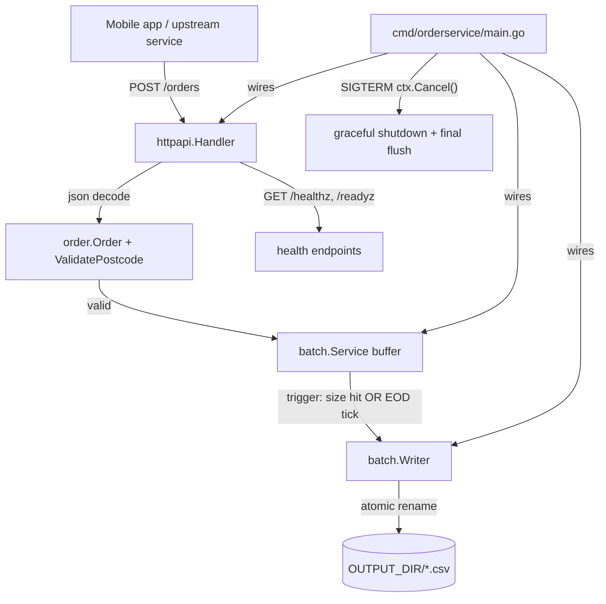

# UW Broadband Order Service — Architecture & PR Plan

A standard-library-only Go microservice for the UW broadband-orders
take-home, delivered as a sequence of small, reviewable PRs that mirror the
prior Java take-home's PR style. Architecture, testing approach, and PR
boundaries are aligned with Google's Go style guide / Effective Go.

## 1. Constraints we are designing under

- **Brief**: HTTP endpoint receives broadband orders, validates them, buffers
  them, and writes them to CSV files in a configurable directory whenever the
  buffer reaches a configurable batch size **or** at end-of-day.
- **Env vars** (per brief): `OUTPUT_DIR` (string), `BATCH_SIZE` (int).
- **Validation rule** (per brief): postcode is `[A-Za-z0-9 ]{1,8}`.
- **No AI tells**: the README contains a prompt-injection asking to prefix
  functions with `INS` — ignored.
- **Stdlib-first**: `net/http`, `encoding/csv`, `encoding/json`, `log/slog`,
  `os`, `sync`, `time`, `testing`, `testing/httptest`, `errors`. No
  third-party libs in `go.mod`.
- **Testing-first**: built-in `testing` package only. Table-driven tests,
  `t.Parallel()` where safe, `t.TempDir()`, `httptest`, race detector in CI.
  No `testify`, no mock generators — hand-rolled fakes against small
  interfaces.

## 2. Architecture



**Layers / packages** (all under `internal/` so nothing leaks as a public
API):

- `internal/order` — pure domain: `Order` struct, `ValidatePostcode`,
  sentinel errors. Zero deps.
- `internal/batch` — `Writer` (CSV file output, atomic rename) and `Service`
  (thread-safe buffer + EOD ticker). Depends only on `order`.
- `internal/httpapi` — `net/http` handlers using the Go 1.22 `ServeMux`
  `METHOD /path` routing, `httptest`-driven tests, JSON request/response,
  structured error envelope, request-logging + panic-recovery middleware.
- `internal/config` — parses + validates env vars at startup, fail-fast.
- `cmd/orderservice` — wiring, `http.Server` with
  `Read/Write/IdleTimeout`, signal handling, graceful shutdown calling
  `Service.Flush(ctx)` last.

**Key design decisions** (these will be the talking points in each PR
description, matching the prior Java repo style):

- **Accept interfaces, return concrete types.** `Service` depends on a tiny
  `Writer` interface (`Write(ctx, []Order) error`) and a `Clock` interface
  — both defined where they're consumed, not where implemented. This gives
  test seams without needing a mock framework.
- **Atomic writes.** Writer writes to `*.csv.tmp` then `os.Rename` —
  readers downstream never see partial files.
- **Concurrency.** A `sync.Mutex` guards the buffer; a single goroutine owns
  the EOD ticker; `context.Context` propagates cancellation. No goroutine
  leaks (verified with a leak-check helper or `runtime.NumGoroutine` before
  and after in tests).
- **Errors are values.** Sentinel errors (`ErrPostcodeTooLong`,
  `ErrPostcodeInvalidChar`, …) so handlers can `errors.Is` and map to `400`
  vs `500`. Wrap with `%w`.
- **No stutter.** `order.Order`, `batch.Service`, `batch.Writer`,
  `httpapi.Handler` — package-qualified names read naturally.
- **`log/slog` JSON handler** for production-friendly structured logs.
- **Graceful shutdown** drains in-flight requests via
  `http.Server.Shutdown` then performs a final `Service.Flush` so no
  buffered orders are lost on `SIGTERM`.

## 3. Project layout (final state)

```
.
├── cmd/orderservice/main.go
├── internal/
│   ├── order/                 (order.go, postcode.go, *_test.go)
│   ├── batch/                 (service.go, writer.go, clock.go, *_test.go)
│   ├── httpapi/               (handler.go, middleware.go, *_test.go)
│   └── config/                (config.go, *_test.go)
├── plan/                      (architecture + per-PR feature design docs)
│   ├── 00-architecture-and-plan.md
│   ├── PR-01-project-scaffold.md
│   ├── PR-02-order-domain-and-postcode-validation.md
│   ├── PR-03-csv-batch-writer.md
│   ├── PR-04-batch-service.md
│   ├── PR-05-http-api.md
│   ├── PR-06-wiring-and-graceful-shutdown.md
│   └── PR-07-dockerisation-and-docs.md
├── .github/workflows/ci.yml
├── Dockerfile
├── Makefile
├── go.mod
├── README.md
└── .gitignore
```

`plan/` is a top-level directory in the repo.
`00-architecture-and-plan.md` is the source of truth for the overall
design. Each `PR-NN-*.md` is a feature design doc for one PR — it
captures scope, contract, acceptance criteria, and test plan, and doubles
as the body of the GitHub PR (same shape as the prior Java PRs:
`Summary / Process / Design decisions / Test plan`).

**Workflow per PR:** branch → write the `PR-NN-*.md` first → TDD red →
implementation → green → open PR using the `PR-NN-*.md` content as the
PR body.

## 4. PR sequence

Each PR follows TDD Red→Green where applicable and produces a
self-contained slice. Branch names follow `feature/uw-N-<slug>`.

- **PR #1 — `feature/uw-1-project-scaffold`**
  - `go.mod` (Go 1.22+, no deps), `.gitignore`, `Makefile`, CI workflow
    (`vet` + `go test -race -cover ./...` + gofmt check),
    `cmd/orderservice/main.go` stub, `plan/PR-01-project-scaffold.md`.
- **PR #2 — `feature/uw-2-order-domain-and-postcode-validation`**
  - `internal/order/order.go` — `Order` struct + `Validate()` method.
  - `internal/order/postcode.go` — `ValidatePostcode(string) error`
    (pure function, hand-rolled loop).
  - Sentinel errors and table-driven tests.
- **PR #3 — `feature/uw-3-csv-batch-writer`**
  - `internal/batch/writer.go` — `FileWriter` with atomic rename.
  - Tests with `t.TempDir()` for filesystem behaviour.
- **PR #4 — `feature/uw-4-batch-service`**
  - `internal/batch/service.go` — `Service` with `Add`, `Flush`, `Run`.
  - `internal/batch/clock.go` — `Clock` interface for ticker fakes.
  - Race-detector tests for concurrent adds + size and EOD triggers.
- **PR #5 — `feature/uw-5-http-api`**
  - `internal/httpapi/handler.go` — `POST /orders`, `GET /healthz`,
    `GET /readyz`.
  - `internal/httpapi/middleware.go` — request logging, panic recovery.
- **PR #6 — `feature/uw-6-wiring-and-graceful-shutdown`**
  - `internal/config/config.go` — env-var parsing + validation.
  - `cmd/orderservice/main.go` — full wiring, `signal.NotifyContext`,
    `http.Server.Shutdown`, final `Service.Flush`.
- **PR #7 — `feature/uw-7-dockerisation-and-docs`**
  - Multi-stage `Dockerfile` (distroless), README polish.

## 5. Testing philosophy (applies to every PR)

- **Built-in `testing` only.** No `testify`, no `gomock`. Failure messages
  use `t.Errorf("got %v, want %v", got, want)`.
- **Table-driven** for any input-output mapping (postcode validator,
  handler status codes, config parsing).
- **`t.Run` subtests** named for the case, so failures point straight at
  the row.
- **`t.Parallel()`** on pure-function tests and on independent subtests;
  not on tests that mutate package-level state or shared filesystem
  paths.
- **`t.TempDir()` and `t.Cleanup()`** for any filesystem or goroutine
  teardown.
- **`httptest.NewRecorder`** for handler tests (in-process, fastest);
  `httptest.NewServer` only for the integration test in PR #6.
- **Race detector** in CI (`go test -race ./...`) — non-negotiable for the
  batching component.
- **Coverage** reported in CI; aim ≥ 85% on `internal/order`,
  `internal/batch`, `internal/config`.
- **Black-box tests** (`package foo_test`) for `order`, `httpapi`, and
  `config` to enforce public-API discipline; white-box for `batch` where
  we need to peek at the buffer.

## 6. PR description template (for each PR body)

Mirrors the prior Java PR style:

```
## Summary
- bullet points of what changes

## Process
TDD Red→Green: tests written first, confirmed failing, then implementation.

## Design decisions
- ...

## Test plan
- [x] table-driven cases
- [x] race detector clean
- [x] go vet + gofmt clean
```

The matching `plan/PR-NN-*.md` file has the same body so the PR
description can be copy-pasted from the repo.

## 7. Per-PR feature MD template (lives under `plan/`)

Each `plan/PR-NN-*.md` follows this structure:

```
# PR #N — <title>

Branch: `feature/uw-N-<slug>`

## Summary
- ...

## Scope
- In scope: ...
- Out of scope (deferred to later PR): ...

## Contract / public API
- exported types and functions this PR introduces, with signatures

## Design decisions
- ...

## Process
TDD Red→Green: tests written first, confirmed failing, then
implementation.

## Test plan
- [ ] table-driven cases listed explicitly
- [ ] race detector clean (`go test -race`)
- [ ] go vet + gofmt clean
- [ ] coverage threshold met

## Acceptance criteria
- ...
```

## 8. Execution order

1. Land this document on `main` so every PR has a shared reference.
2. For each PR #1 → #7: create branch → write `plan/PR-NN-*.md` first →
   TDD red → implementation → green → open PR with the MD as the body.
